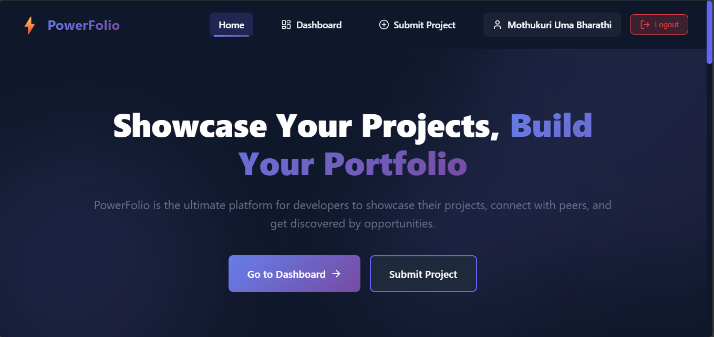
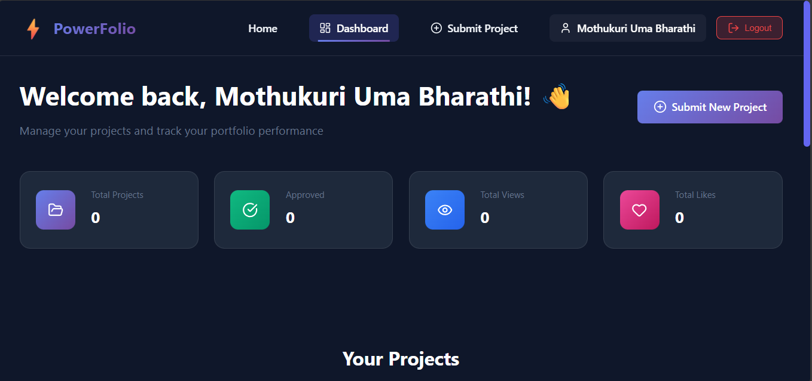
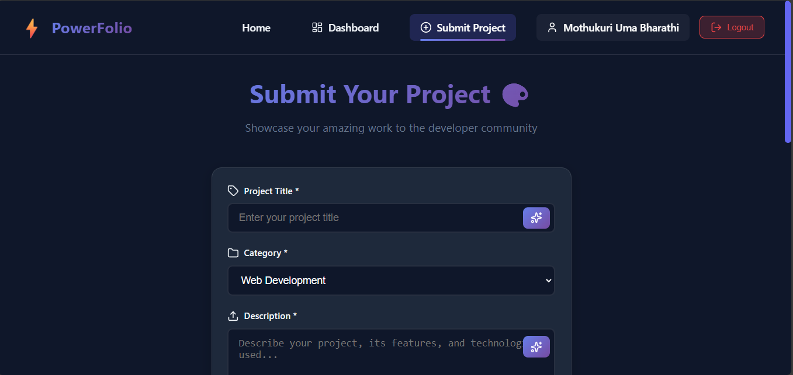

🚀 PowerFolio - Next-Gen Developer Portfolio Platform

A modern, full-featured platform for developers to showcase their projects and build impressive portfolios

Overview
PowerFolio is a comprehensive web application designed to revolutionize how developers showcase their work. Built with React and modern web technologies, it provides an intuitive platform for students and developers to create stunning project portfolios, connect with peers, and get discovered by recruiters.

Why PowerFolio?
In today's competitive tech landscape, having a strong online portfolio is crucial. PowerFolio solves the challenge of project presentation by offering:

Centralized Portfolio Management - One place for all your projects
Professional Presentation - Beautiful, responsive layouts that impress
Community Engagement - Connect with other developers and get feedback
Quality Control - Admin-moderated content ensures high standards
Analytics & Insights - Track your portfolio's performance
🔍 Problem Statement
Challenge: Developers and students struggle to effectively showcase their projects in a professional, organized manner. Existing platforms are either:

Too complex and bloated
Lack proper project management features
Don't provide engagement metrics
Offer poor mobile experiences
Missing quality control mechanisms
Impact: This results in missed opportunities, poor first impressions with recruiters, and difficulty standing out in a crowded job market.

💡 Solution
PowerFolio addresses these challenges through:

1. Streamlined Project Submission
Simple, intuitive forms with validation
AI-powered content enhancement
Rich media support (images, links, descriptions)
Categorization and tagging system
2. Professional Presentation
Modern, responsive design that works on all devices
Beautiful project cards with hover effects
Detailed project pages with complete information
Clean, distraction-free viewing experience
3. Quality Assurance
Admin review system for all submissions
Three-tier approval workflow (Pending → Approved/Rejected)
Spam and low-quality content filtering
Maintains platform credibility
4. Engagement & Analytics
Real-time view tracking
Like/reaction system
Share functionality
Comprehensive analytics dashboard
5. User Management
Secure authentication system
Role-based access control (Admin/User)
Personalized dashboards
Project management tools
✨ Key Features
🔐 Authentication System
Secure Signup/Login - Email-based authentication with validation
Session Management - Persistent login sessions
Protected Routes - Secured pages requiring authentication
Role-Based Access - Admin and User privileges
Logout Functionality - Clean session termination
📊 User Dashboard
Project Overview - Visual cards showing all your projects
Performance Metrics - Views, likes, and engagement stats
Status Tracking - Monitor approval status (Pending/Approved/Rejected)
Quick Actions - Edit, delete, and manage projects
Statistics Cards - Total projects, approved count, view/like totals
📝 Project Management
Submit Projects - Comprehensive form with all necessary fields
Rich Descriptions - Multi-line text support with formatting
Technology Tags - Categorize by tech stack
External Links - GitHub repos and live demo URLs
Image Upload - Visual representation of projects
Edit Capability - Update project details anytime
Delete Option - Remove unwanted projects
🤖 AI Enhancement
Smart Title Generation - AI-powered title improvements
Description Enhancement - Automatically add key features
One-Click Optimization - Instant content enhancement
Professional Touch - Makes projects stand out
🏠 Home Page
Featured Projects - Showcase of approved projects
Advanced Search - Keyword-based project discovery
Category Filters - Browse by technology (Web, Mobile, AI/ML, etc.)
Responsive Grid - Beautiful project card layout
Hero Section - Engaging landing experience
Feature Highlights - Platform benefits showcase
📄 Project Detail Pages
Complete Information - Full project details and description
Technology Stack - Visual tech tag display
External Links - Quick access to GitHub and live demos
Engagement Metrics - View count and likes
Author Information - Developer details
Social Sharing - Share projects easily
Interactive Actions - Like and share buttons
👨‍💼 Admin Panel
Project Moderation - Review and approve/reject submissions
User Management - View all registered users
Analytics Dashboard - Platform-wide statistics
Bulk Actions - Manage multiple projects efficiently
Status Filters - View by pending/approved/rejected
User Insights - Track user activity and contributions
🔍 Search & Discovery
Keyword Search - Find projects by title, description, or technology
Category Filtering - Filter by project type
Real-time Results - Instant search feedback
Smart Suggestions - Intelligent search recommendations
📱 Responsive Design
Mobile-First - Optimized for smartphones
Tablet Support - Perfect on iPads and tablets
Desktop Experience - Full-featured on large screens
Flexible Layouts - Adapts to any screen size
Touch-Friendly - Easy navigation on touch devices
🎨 Modern UI/UX
Dark Theme - Eye-friendly design with gradient accents
Smooth Animations - Polished transitions and effects
Hover Interactions - Engaging micro-interactions
Loading States - Clear feedback during operations
Error Handling - User-friendly error messages
Success Notifications - Confirmation alerts
🛠️ Tech Stack
Frontend
Technology	Purpose	Version
React	UI Library	18.x
React Router DOM	Navigation & Routing	6.x
Lucide React	Icon Library	Latest
Framer Motion	Animations	Latest
CSS3	Styling	-
Key Libraries & Tools
Context API - State management
Custom Hooks - Reusable logic
CSS Variables - Theming system
CSS Grid & Flexbox - Layout
Local Storage API - Data persistence (simulated)
Development Tools
Create React App - Project scaffolding
npm - Package management
ES6+ JavaScript - Modern syntax
Git - Version control
🏗️ Architecture
Component Hierarchy
App
├── Navbar (Global)
├── Routes
│   ├── Home
│   │   └── ProjectCard (Multiple)
│   ├── Login
│   ├── Signup
│   ├── Dashboard (Protected)
│   │   └── Project Stats & Table
│   ├── SubmitProject (Protected)
│   │   └── Form Components
│   ├── ProjectDetail
│   │   └── Engagement Components
│   └── AdminPanel (Admin Only)
│       ├── Projects Tab
│       ├── Users Tab
│       └── Analytics Tab
└── Footer (Global)
State Management
AuthContext (Global)
├── User State
├── Authentication Functions
│   ├── login()
│   ├── signup()
│   └── logout()
└── Authorization Checks
Data Flow
User Action → Component → Context/Storage → Update State → Re-render UI
Routing Strategy
Public Routes: Home, Login, Signup, Project Detail
Protected Routes: Dashboard, Submit Project (requires auth)
Admin Routes: Admin Panel (requires admin role)
Redirect Logic: Unauthorized users → Login page
📦 Installation & Setup
Prerequisites
Ensure you have the following installed:

Node.js (v14.0.0 or higher) - Download
npm (v6.0.0 or higher) - Comes with Node.js
Git - Download
Code Editor - VS Code recommended
Step 1: Clone the Repository
bash
git clone https://github.com/yourusername/powerfolio.git
cd powerfolio
Step 2: Install Dependencies
bash
npm install
This will install:

react
react-dom
react-router-dom
lucide-react
framer-motion
All other dependencies
Step 3: Environment Setup (Optional)
Create a .env file in the root directory:

env
REACT_APP_NAME=PowerFolio
REACT_APP_VERSION=1.0.0
Step 4: Start Development Server
bash
npm start
The application will open at http://localhost:3000

Step 5: Build for Production
bash
npm run build
Creates optimized production build in build/ folder

📖 Usage Guide
For New Users
1. Create an Account
Navigate to /signup
Fill in your name, email, and password
Click "Create Account"
You'll be automatically logged in
2. Submit Your First Project
Go to "Submit Project" from navbar
Fill in project details:
Title (e.g., "E-Commerce Platform")
Description (explain your project)
Category (Web Development, Mobile, etc.)
Technologies (React, Node.js, MongoDB)
GitHub URL (optional)
Live Demo URL (optional)
Project Image URL
Use AI Enhancement for better content
Click "Submit Project"
Wait for admin approval
3. Manage Your Portfolio
Visit your Dashboard
View all submitted projects
Check approval status
Edit project details
Delete unwanted projects
Track views and likes
4. Explore Other Projects
Browse home page for featured projects
Use search to find specific projects
Filter by category
Click on projects to view details
Like projects you appreciate
Share interesting projects
For Administrators
1. Access Admin Panel
Login with admin credentials:
Email: admin@powerfolio.com
Password: admin123
Navigate to "Admin" in navbar
2. Review Projects
Go to "Projects" tab
Filter by status (Pending/Approved/Rejected)
Review project details
Click ✓ to approve quality projects
Click ✗ to reject inappropriate content
Click 🗑️ to permanently delete
3. Manage Users
Go to "Users" tab
View all registered users
See user details and join dates
Monitor user activity
Track projects per user
4. View Analytics
Go to "Analytics" tab
Monitor platform statistics:
Total projects submitted
Approval/rejection rates
Total views and likes
User growth
Engagement metrics

## 📸 Screenshots

### 🏠 Home Page

### 📊 Dashboard

### 🎥 Submit New Project

### 🎥 Projects

### 🎥 Submit New Project1

📁 Project Structure
powerfolio/
├── public/
│   ├── index.html
│   ├── favicon.ico
│   └── manifest.json
├── src/
│   ├── components/
│   │   ├── Navbar.js
│   │   ├── Navbar.css
│   │   ├── Footer.js
│   │   ├── Footer.css
│   │   ├── ProjectCard.js
│   │   ├── ProjectCard.css
│   │   └── ProtectedRoute.js
│   ├── pages/
│   │   ├── Login.js
│   │   ├── Signup.js
│   │   ├── Auth.css
│   │   ├── Home.js
│   │   ├── Home.css
│   │   ├── Dashboard.js
│   │   ├── Dashboard.css
│   │   ├── SubmitProject.js
│   │   ├── SubmitProject.css
│   │   ├── ProjectDetail.js
│   │   ├── ProjectDetail.css
│   │   ├── AdminPanel.js
│   │   └── AdminPanel.css
│   ├── context/
│   │   └── AuthContext.js
│   ├── utils/
│   │   └── storage.js
│   ├── App.js
│   ├── App.css
│   └── index.js
├── package.json
├── README.md
└── .gitignore
File Descriptions
File	Purpose
App.js	Main application component with routing
AuthContext.js	Authentication state management
storage.js	Data persistence utilities
Navbar.js	Global navigation component
Footer.js	Global footer component
ProjectCard.js	Reusable project card
ProtectedRoute.js	Route protection wrapper
Login.js	Login page
Signup.js	Registration page
Home.js	Landing & browse page
Dashboard.js	User portfolio management
SubmitProject.js	Project submission form
ProjectDetail.js	Individual project view
AdminPanel.js	Admin management interface
🚀 Future Enhancements
Phase 1 (Immediate)
 Backend API integration (Node.js + Express)
 Database implementation (MongoDB)
 Real file upload functionality
 Email verification system
 Password reset feature
Phase 2 (Short-term)
 Social media login (Google, GitHub)
 Comment system for projects
 Rating/review system
 User profiles with avatars
 Project tags and advanced filtering
 Bookmark/save projects feature
Phase 3 (Mid-term)
 Real-time notifications
 Direct messaging between users
 Project collaboration requests
 Portfolio export (PDF/Website)
 Advanced analytics with charts
 SEO optimization
Phase 4 (Long-term)
 AI-powered project recommendations
 Skill assessment integration
 Job board integration
 Video project presentations
 API for third-party integrations
 Mobile app (React Native)

📄 License
This project is licensed under the MIT License - see the LICENSE file for details.

👨‍💻 Author
Mothukuri Uma Bharathi

GitHub: github.com/Uma1625
LinkedIn: https://www.linkedin.com/in/umabharathi-mothukuri
Email: umabharathimothukuri@gmail.com

